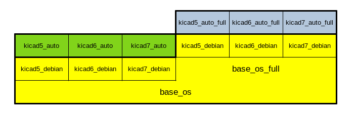

# kicad_auto

Docker image for KiCad automation scripts suitable for CI/CD

The main objetive is to use it as a base for [KiCad automation in CI/CD environments](https://github.com/INTI-CMNB/KiBot).

The images are uploaded to [Docker Hub](https://hub.docker.com/r/setsoft/kicad_auto) and GitHub:
[KiCad 5](https://github.com/INTI-CMNB/kicad_auto/pkgs/container/kicad5_auto),
[KiCad 6](https://github.com/INTI-CMNB/kicad_auto/pkgs/container/kicad6_auto),
[KiCad 7](https://github.com/INTI-CMNB/kicad_auto/pkgs/container/kicad6_auto) and
[Old compatibility names](https://github.com/INTI-CMNB/kicad_auto/pkgs/container/kicad_auto),

This image is based on [kicad_debian](https://github.com/INTI-CMNB/kicad_debian) and adds some automation tools to it:

* [KiBot](https://github.com/INTI-CMNB/KiBot) generate gerbers, drill, position files, etc.
* [KiAuto](https://github.com/INTI-CMNB/KiAuto) runs DRC/ERC, prints schematics, PCB, etc.
* [KiBoM](https://github.com/INTI-CMNB/KiBoM) generates HTML and CSV BoMs
* [InteractiveHtmlBom](https://github.com/INTI-CMNB/InteractiveHtmlBom) generates interactive HTML BoMs
* [KiCost](https://github.com/hildogjr/KiCost) generates BoMs with prices
* [KiCad Git filters](https://github.com/INTI-CMNB/kicad-git-filters) helps to reduce unneeded commits for KiCad files when using git
* [KiCad PCB diff](https://github.com/INTI-CMNB/kicad_pcb-diff) a tool to see differences between PCBs, can be used as git plugin
* [KiKit](https://github.com/yaqwsx/KiKit) stencil and panelization tools

The relation between the packages that contains the images is as depicted in the following image:




Here are some of the available images:

## KiCad 5

| Name                                      | KiBot  | KiCad | Debian | KiAuto | KiBoM   | iBoM     | KiCost | DK plug | PcbDraw | KiDiff |
| :---------------------------------------- | ------ | ----- | ------ | ------ | ------- | -------- | ------ | ------- | ------- | -----: |
| setsoft/kicad_auto:10.3-5.1.5             | 0.2.4  | 5.1.5 |  10.3  | 1.3.1  | 1.6.3   | 2.3.1    |   --   |   --    |   --    |   --   |
| setsoft/kicad_auto:10.4-5.1.6             | 0.7.0  | 5.1.6 |  10.4  | 1.4.2  | 1.8.0   | 2.3.3    |   --   |   --    | 0.6.0-2 |   --   |
| ghcr.io/inti-cmnb/kicad5_auto:1.2.0       | 1.2.0  | 5.1.9 |  10.4  | 1.6.15 | 1.8.0   | 2.5.0    | 1.1.10 |  0.1.1  | 0.9.0-3 |   --   |
| ghcr.io/inti-cmnb/kicad5_auto:1.3.0       | 1.3.0  | 5.1.9 |  11.5  | 2.0.6  | 1.8.0-2 | 2.5.0    | 1.1.12 |  0.1.2  | 0.9.0-4 |  2.4.2 |
| ghcr.io/inti-cmnb/kicad5_auto:1.4.0       | 1.4.0  | 5.1.9 |  11.5  | 2.0.6  | 1.8.0-3 | 2.5.0-2  | 1.1.15 |  0.1.2  | 0.9.0-5 |  2.4.3 |
| ghcr.io/inti-cmnb/kicad5_auto:1.5.1       | 1.5.1  | 5.1.9 |  11.6  | 2.1.1  | 1.8.0-3 | 2.5.0-2  | 1.1.15 |  0.1.2  | 0.9.0-5 |  2.4.3 |
| ghcr.io/inti-cmnb/kicad5_auto:1.6.0       | 1.6.0  | 5.1.9 |  11.6  | 2.2.1  | 1.8.0-3 | 2.5.0-3  | 1.1.15 |  0.1.2  |   --    |  2.4.5 |
| ghcr.io/inti-cmnb/kicad5_auto:1.6.1       | 1.6.1  | 5.1.9 |  11.6  | 2.2.1  | 1.8.0-3 | 2.5.0-3  | 1.1.15 |  0.1.2  |   --    |  2.4.5 |

## KiCad 6

| Name                                      | KiBot  | KiCad  | Debian | KiAuto | KiBoM   | iBoM     | KiCost | DK plug | PcbDraw | KiDiff | KiKit   |
| :---------------------------------------- | ------ | ------ | ------ | ------ | ------- | -------- | ------ | ------- | ------- | ------ | ------: |
| setsoft/kicad_auto:ki6.0.0_Ubuntu21.10    | 0.11.0 | 6.0.0  | U21.10 | 1.6.5  | 1.8.0   | 2.4.1    | 1.1.15 |  0.1.2  | 0.9.0-1 |   --   |  --     |
| ghcr.io/inti-cmnb/kicad6_auto:1.2.0       | 1.2.0  | 6.0.5  |  11.3  | 1.6.15 | 1.8.0-2 | 2.5.0    | 1.1.10 |  0.1.1  | 0.9.0-3 |   --   |  --     |
| ghcr.io/inti-cmnb/kicad6_auto:1.3.0       | 1.3.0  | 6.0.7  |  11.5  | 2.0.6  | 1.8.0-2 | 2.5.0    | 1.1.12 |  0.1.2  | 0.9.0-4 |  2.4.2 |  --     |
| ghcr.io/inti-cmnb/kicad6_auto:1.5.1       | 1.5.1  | 6.0.10 |  11.6  | 2.1.1  | 1.8.0-3 | 2.5.0-2  | 1.1.15 |  0.1.2  | 0.9.0-5 |  2.4.3 | 1.2.0   |
| ghcr.io/inti-cmnb/kicad6_auto:1.6.0       | 1.6.0  | 6.0.11 |  11.6  | 2.2.1  | 1.8.0-3 | 2.5.0-3  | 1.1.15 |  0.1.2  |   --    |  2.4.5 | 1.3.0-5 |
| ghcr.io/inti-cmnb/kicad6_auto:1.6.1       | 1.6.1  | 6.0.11 |  11.6  | 2.2.1  | 1.8.0-3 | 2.5.0-3  | 1.1.15 |  0.1.2  |   --    |  2.4.5 | 1.3.0-5 |

## KiCad 7

| Name                                      | KiBot  | KiCad   | Debian | KiAuto | KiBoM   | iBoM     | KiCost | DK plug | KiDiff | KiKit   |
| :---------------------------------------- | ------ | ------- | ------ | ------ | ------- | -------- | ------ | ------- | ------ | ------: |
| ghcr.io/inti-cmnb/kicad7_auto:1.6.1       | 1.6.1  | 7.0.1.1 |  11.6  | 2.2.1  | 1.8.0-3 | 2.5.0-3  | 1.1.15 |  0.1.2  |  2.4.5 | 1.3.0-5 |

You can run it using a script like this:

```
export USER_ID=$(id -u)
export GROUP_ID=$(id -g)
export WORKDIR=RELATIVE_PATH_TO_KICAD_PROJECTS
export SUBDIR=SUBDIR_INSIDE_WORKDIR
docker run --rm -it -v /tmp/.X11-unix:/tmp/.X11-unix -e DISPLAY=$DISPLAY \
    -v $(pwd)/$WORKDIR:/home/$USER/workdir \
    --user $USER_ID:$GROUP_ID \
    --env NO_AT_BRIDGE=1 \
    --workdir="/home/$USER" \
    --volume="/etc/group:/etc/group:ro" \
    --volume="/home/$USER/.config/kicad:/home/$USER/.config/kicad:rw" \
    --volume="/home/$USER/.cache/kicad:/home/$USER/.cache/kicad:rw" \
    --volume="/etc/passwd:/etc/passwd:ro" \
    --volume="/etc/shadow:/etc/shadow:ro" \
    ghcr.io/inti-cmnb/kicad7_auto:1.6.1 /bin/bash -c "cd workdir/$SUBDIR; kibot"
```


